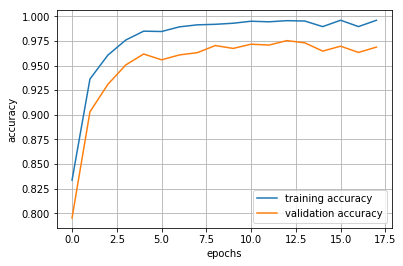
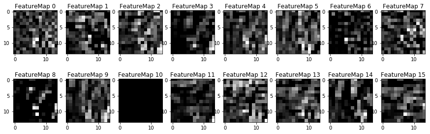

# Self-Driving Car Engineer Nanodegree

## Deep Learning

## Project: Build a Traffic Sign Recognition Classifier

---

The goals / steps of this project are the following:

* Load the dataset
* Explore, summarize and visualize the data set
* Design, train and test a model architecture
* Use the model to make predictions on new images
* Analyze the softmax probabilities of the new images
* Summarize the results with a written report

---

## Step 1: Dataset summary and exploration

The used dataset can be found [here](https://s3-us-west-1.amazonaws.com/udacity-selfdrivingcar/traffic-signs-data.zip).

### Basic summary of the dataset

* Number of training examples:      34799     
* Number of validation examples:    4410      
* Number of testing examples:       12630     
* Image shape:                      32x32x3   
* Number of classes:                43        

### Exploratory visualization of the dataset

Example images of each class:

Class distributions for training, validation and test set:

### Data augmentation

In order to balance the existing unbalanced training data, the data is augmented in two steps. First, all classes are balanced by simply copying the existing images until each class contains the required number of images. Second, affine transformations are performed with random parameters in small specified ranges on all images. The new training set distribution is shown below.

----

## Step 2: Design and test of a model architecture

### 2.1 Preprocessing

For preprocessing the images, normalization and grayscaling were used. 
Normalizing the data is numerically beneficial since computations with very big and small numbers are avoided. Those would lead to relatively large errors in the loss function. Additionally, the optimizer easier finds a solution when normalized values are used. Grayscaling led to a slightly increased performance, which is why it is applied in preprocessing.

### 2.2 Model Architecture

The final model consists of the following layers:

1. Layer: Convolutional
    * Convolution: input (32x32x1), output (28x28x16)
    * Activation ReLU
    * Pooling: input (28x28x16), output (14x14x16)
2. Layer: Convolutional
    * Convulution: input (14x14x16), output (10x10x25)
    * Activation: ReLU
    * Pooling: input (10x10x25), output (5x5x25)
    * Flattening: input (5x5x25), output (625)
3. Layer: Fully connected
    * Layer size: 400
    * Activation: ReLU
    * Dropout: 50%
4. Layer: Fully connected
    * Layer size: 256
    * Activation: ReLU
    * Dropout: 50%
5. Layer: Fully connected
    * Layer size: 128
    * Activation: ReLU
    * Dropout: 50%
6. Layer: Fully connected
    * Layer size: 43
    * Output: logits (43)

### 2.3 Model training

The model was trained using the ADAM optimizer, since it is widely used and was recommended in the lessons. The batch size did not seem to have a large influence on the results - a value of 128 was chosen. The number of epochs is set to 100, but the training process is interupted after no increase in validation accuracy for 5 epochs. For regularization, the L2 method was tested, but led to a significantly decreased accuracy, so it was not used here. Dropout is used instead in all fully connected layers. The dropout keep-rate was set to 50% during training and to 100% for validation and further testing. A training rate of 0.001 was chosen.

### 2.4 Solution approach

Final results:

* Training accuracy: 99.6%
* Validation accuracy: 97.5%
* Test accuracy: 95.5%

Since the project is about classifying images, a convolutional networks is chosen. These types of networks are well suited for image classification tasks due to their shared weights which lead to translation invariance of the features. This is important, since an object remains the same, no matter where it appears in an image.

The LeNet-5 architecture was chosen as a starting point since it was already used in the lessons and led to relativaly high validation accuracy values of ~96% on the MNIST dataset. With the original LeNet architecture, a validation accuracy of 94% was reached on the traffic sign data. To reach a higher accuracy while preventing overfitting, the network architecture was extended  as follows:

* Increased number of convolution filters
* Increased size of fully connected layers
* Additional fully connected layer
* Use of dropout in the fully connected layers (prevents overfitting)

The final hyperparameter combination was found by trial-and-error, since a systematic approch seemed too expensive with the given setup.

Since training, validation and test accuracy are all relatively high and within the same range, the model seems well-suited for classifying new traffic sign images.

The following plot shows the accuracy over the number of epochs during training.

### Confusion matrix, precision and recall

For further analysis, the confusion matrix as well as precision and recall values for each class are shown below.

| Sign id |Sign name               | Precision  | Recall |
|---:|:---|:---|:---|
| 0|   Speed limit (20km/h)                                 |0.833333   | 1           |
| 1|   Speed limit (30km/h)                                 |0.975035   | 0.976389    |
| 2|   Speed limit (50km/h)                                 |0.958995   | 0.966667    |
| 3|   Speed limit (60km/h)                                 |0.917258   | 0.862222    |
| 4|   Speed limit (70km/h)                                 |0.981453   | 0.962121    |
| 5|   Speed limit (80km/h)                                 |0.883234   | 0.936508    |
| 6|   End of speed limit (80km/h)                          |1          | 0.94        |
| 7|   Speed limit (100km/h)                                |0.986877   | 0.835556    |
| 8|   Speed limit (120km/h)                                |0.884      | 0.982222    |
| 9|   No passing                                           |0.954      | 0.99375     |
| 10|  No passing for vehicles over 3.5 metric tons         |0.987934   | 0.992424    |
| 11|  Right-of-way at the next intersection                |0.994937   | 0.935714    |
| 12|  Priority road                                        |0.991228   | 0.982609    |
| 13|  Yield                                                |0.995833   | 0.995833    |
| 14|  Stop                                                 |0.940767   | 1           |
| 15|  No vehicles                                          |0.913043   | 1           |
| 16|  Vehicles over 3.5 metric tons prohibited             |0.993377   | 1           |
| 17|  No entry                                             |0.997126   | 0.963889    |
| 18|  General caution                                      |0.968208   | 0.858974    |
| 19|  Dangerous curve to the left                          |0.923077   | 1           |
| 20|  Dangerous curve to the right                         |0.894737   | 0.944444    |
| 21|  Double curve                                         |0.780702   | 0.988889    |
| 22|  Bump|y road  1                                       |0.963303   | 0.875       |
| 23|  Slippery road                                        |0.870588   | 0.986667    |
| 24|  Road narrows on the right                            |0.866667   | 0.866667    |
| 25|  Road work                                            |0.978814   | 0.9625      |
| 26|  Traffic signals                                      |0.954545   | 0.933333    |
| 27|  Pedestrians                                          |0.75       | 0.5         |
| 28|  Children crossing                                    |0.960526   | 0.973333    |
| 29|  Bicycles crossing                                    |0.6        | 1           |
| 30|  Beware of ice/snow                                   |0.856164   | 0.833333    |
| 31|  Wild animals crossing                                |0.981685   | 0.992593    |
| 32|  End of all speed and passing limits                  |0.9375     | 1           |
| 33|  Turn right ahead                                     |0.976744   | 1           |
| 34|  Turn left ahead                                      |0.983607   | 1           |
| 35|  Ahead only                                           |0.99734    | 0.961538    |
| 36|  Go straight or right                                 |0.991736   | 1           |
| 37|  Go straight or left                                  |0.952381   | 1           |
| 38|  Keep right                                           |0.997019   | 0.969565    |
| 39|  Keep left                                            |1          | 0.955556    |
| 40|  Roundabout mandatory                                 |0.943182   | 0.922222    |
| 41|  End of no passing                                    |1          | 0.8         |
| 42|  End of no passing by vehicles over 3.5 metric tons   |0.989011   | 1           |

---

## Step 3: Test on new images

### 3.1 New images and possible difficulties for classification

The following 12 images were found on the web. Number 0-3 are expected to be difficult to classify since they are all covered partly by stickers or graffity. Number 4 could also be difficult to classify because the shape of the sign is modified by other signs above and behind it.

### 3.2 Sign type prediction for each new image and performance analysis

The model was able to classify 11 of the 12 new images correctly and is thereby 92% accurate on these image.

| #   | Traffic sign | Prediction | Predicted correct |
| --- | :--- | :--- | ---
| 0   | Priority road | Priority road | True |
| 1   | No entry | No entry | True |
| 2   | No vehicles | No passing | False |
| 3   | Yield | Yield | True |
| 4   | Keep right | Keep right | True |
| 5   | Right-of-way at the next intersection | Right-of-way at the next intersection | True |
| 6   | Bumpy road | Bumpy road | True |
| 7   | Stop | Stop | True |
| 8   | Road work | Road work | True |
| 9   | Turn right ahead | Turn right ahead | True |
|10   | Speed limit (30km/h) | Speed limit (30km/h) | True |
|11   | Roundabout mandatory | Roundabout mandatory | True |

### 3.3 Top 5 softmax probabilities for the new images

For all 12 images, the model is very sure that the predictions are correct (probabilities all >90%).
Only image number 2 is falsely classified ('no passing' instead of 'no vehicles'). However, this can likely be explained by increased difficulty due to vandalism.

| #   | Traffic sign | Highest softmax probability |
| --- | :--- | ---: |
| 0   | Priority road                         | 100.00%|
| 1   | No entry                               | 99.84%|
| 2   | No vehicles                            | 99.68%|
| 3   | Yield                                 | 100.00%|
| 4   | Keep right                            | 100.00%|
| 5   | Right-of-way at the next intersection  | 91.52%|
| 6   | Bumpy road                            | 100.00%|
| 7   | Stop                                  | 100.00%|
| 8   | Road work                             | 100.00%|
| 9   | Turn right ahead                      | 100.00%|
|10   | Speed limit (30km/h)                  | 100.00%|
|11   | Roundabout mandatory                   | 99.98%|

---

## Step 4 Visualization of the neural network's state with test images

The visual output of the trained network's first and second layer feature maps are shown below.
Fed with a stop sign, the first layer feature maps clearly show that the network detects useful features of the sign, like the outer shape and the shape of the word 'STOP'. In contrast, the feature maps don't show any useful features when activated by an image without a traffic sign (the image shows a part of a tree).

#### Feature map visualization of a traffic sign image

#### Feature map visualization of an image without a traffic sign

